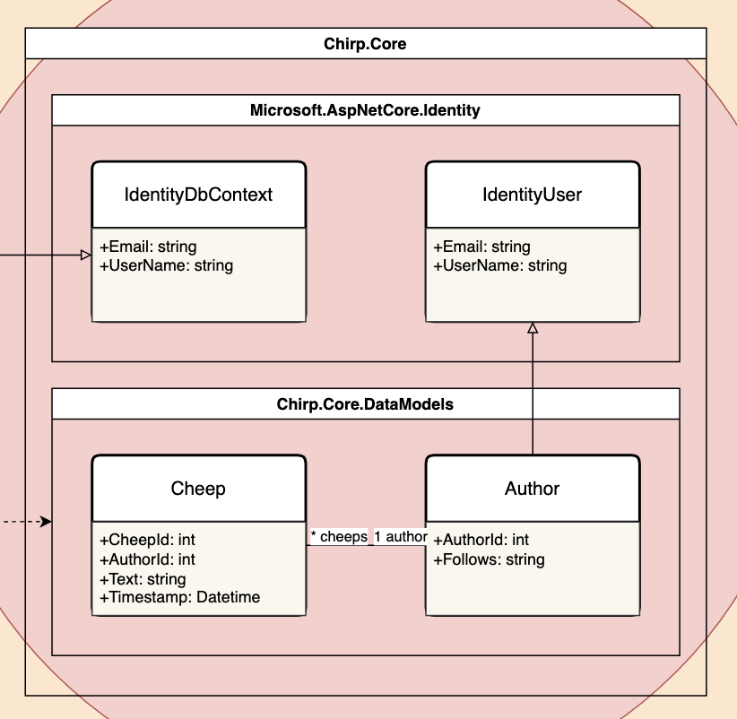
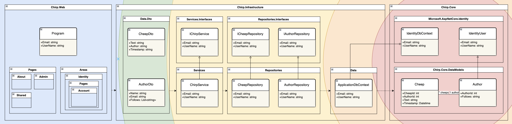

---
title: _Chirp!_ Project Report
subtitle: ITU BDSA 2024 Group `<no>`
author:
- "Helge Pfeiffer <ropf@itu.dk>"
- "Adrian Hoff <adho@itu.dk>"
numbersections: true
---
_Chirp!_ Project Report
==============
***ITU BDSA 2024 Group 5***
- Markus Sværke Staael <msvs@itu.dk>
- Patrick Shen <pash@itu.dk>
- Frederik Terp <fter@itu.dk>
- Nicky Ye <niye@itu.dk>
- mariuslarsen <coml@itu.dk>
- salj <salj@itu.dk>
<div style="page-break-after: always;"></div>

# Table of Contents
1. [Design and Architecture of _Chirp!_](#design)
2. [Domain Model](#domain)
3. [Architecture - In the small](#architecture)
4. [Architecture of deployed application](#deployed)
5. [User activities](#useractivities)
6. [Sequence of functionality/calls through _Chirp!_](#sequence)
7. [Process](#process)
8. [Build, test, release and deployment](#buildtest)
9. [Team work](#teamwork)
10. [How to make _Chirp!_ work locally](#localchirp)
11. [How to run test suite locally](#localtest)
12. [Ethics](#ethics)
13. [License](#license)
14. [LLMs, ChatGPT, CoPilot, and others](#chatgpt)

# Design and Architecture of _Chirp!_ <a name="design"></a>

## Domain model <a name="domain"></a>


<br>
The Chirp application actively utilizes an onion architecture to promote a clear separation of concern.
The onion has many layers but the core of it is Chirp.Core, where the domain model resides. 
The domain model is relatively simple and represents authors and cheeps.
The author model extends an IdentityUser from Asp.Net Core Identity to make it work seamlessly 
with the rest of the Asp.Net Core ecosystem. 

## Architecture — In the small <a name="architecture"></a>


<br>
As previously mentioned the onion architecture has many layers, but so far we have only covered the core. The rest of the layers are categorized as
Chirp.Infrastructure and Chirp.Web with the thickest layer being the infrastructure layer. 

The infrastructure layer can be further broken down in three sublayers. Starting from the inside and moving out
there is a ApplicationDbContext that extends an IdentityDbContext to make it work seamlessly with the rest of the Asp.Net Core ecosystem.
The purpose of the ApplicationDbContext is to provide a way to interact with the entities in the database.

The next layer is the repository layer that interacts with the ApplicationDbContext by implementing methods to extract specific data from the database. 
To comply with the repository pattern there are two repositories, the author repository and the cheep repository that both
interact with their respective entities in the database.

To interact with both author and cheep entities in a simple manner, a chirp service is implemented that uses the two repositories.
The service combines the two repositories by implementing identical methods that call the repository methods.
Another purpose of the service is also make development easier by providing only a single point of access to the database, to be injected.

Both repositories and the service implement respective interfaces to enable dependency injection and make the code more testable.

The last layer of the infrastructure layer is the data transfer object layer. The data transfer objects serve the purpose of only
providing the necessary data to not expose the entire domain model to the user as there can be sensitive or unnecessary data.

The web layer is the outermost layer and is responsible for handling the frontend portion of the chirp application 
by providing a user interface.


## Architecture of deployed application <a name="deployed"></a>


## User activities <a name="useractivities"></a>
This section illustrates typical scenarios that the user may go through when using our *Chirp!* application.
This goes for both unauthorised and authorised users, in which both cases have been included.
The illustrations are shown as sequence of activities in the format of UML Activity Diagrams.


This diagram illustrates the registration of a user.
When a user registers, if all criteria fulfilled, they will be led to the email confirmation page. 
In the case of a missing criteria, e.g. the user has typed an invalid e-mail address, the warning displayed
will inform the user about said missing criteria.


This diagram displays the sequence of user activity, if the user
wishes to type a cheep.
If the message box is empty, a warning will be displayed.


This diagram shows what occurs once a user tries to follow another user.
If user isn't logged in, they will be redirected to the login page. Otherwise,
whether the user already follows someone else or not, either 'Follow' or 'Unfollow'
will be displayed.


This diagram simply views the sequence if a user wishes to view their own page. User
must be logged in before being able to do so.


If a user wishes to delete their data, this user activity sequence would be a typical
scenario.

## Sequence of functionality/calls through _Chirp!_ <a name="sequence"></a>

# Process <a name="process"></a>

## Build, test, release, and deployment <a name="buildtest"></a>

## Team work <a name="teamwork"></a>

NEED IMAGE 


The process "from issue to solution" starts after all members having attended any weeks lecture. Shortly after that lecture the group will find a room to sit and organize themselves, here a few group members start identifying and then quantifying this weeks problems by creating issue tickets. 
When all problems have their respective issue tickets, the group will subdivide itself and create smaller groups where individuals work together to solve the specific issue(s). A new branch will be created where all work for the feature/fix will be deposited. Whenever a specific issue is solved, its respective branch may be merged into main and their issue will be closed. If an issue is not solved during that day, individuals will work from home to solve/close the issue, or if needed, the group will meet again before the next weeks lecture (when new issues will be added).


## How to make _Chirp!_ work locally <a name="localchirp"></a>

### Running from Compiled
1. Access [our release page](https://github.com/ITU-BDSA2024-GROUP5/Chirp/releases "Title"). 
2. Download the zip containing the compiled version of the program corresponding to the system you want it to run on. 
3. Unzip the zip file into a given directory / %unzippedcontentdir%

    #### UNIX-based systems
    4. Open up terminal and run the following
    5. 
        ```
        cd %unzippedcontentdir%/publish/%systemarchitecture%
        ./Chirp.Web
        ```
    #### Windows
    4. Open up CMD and run the following
    5. 
        ```
        cd %unzippedcontentdir%/publish/win-x64
        Chirp.Web.exe
        ```

6. The terminal/cmd should now show the following: Now listening on: http://localhost:5000
7. Accessing your localhost on the given port should now give you access to the local running instance of the web-app

### Running from Source code
1. Pull the source code from github, can be done by opening terminal/cmd and typing the following
```
git pull https://github.com/ITU-BDSA2024-GROUP5/Chirp.git
```
2. Navigate to the project directory and run
```
cd Chirp/src/Chirp.Web
dotnet run
```
3. By default the terminal should now show - Now listening on: http://localhost:5177

If not follow the following steps.
1. Run ```dotnet dev-certs https --trust```
2. Set user secrets by
```
dotnet user-secrets init
dotnet user-secrets set "authentication:github:clientId" "YOURCLIENTID"
dotnet user-secrets set "authentication:github:clientSecret" "YOURCLIENTSECRET"
```


## How to run test suite locally <a name="localtest"></a>
a

# Ethics <a name="ethics"></a>

## License <a name="license"></a>
<br>
The license chosen for the program is the MIT license due to its simplicity and flexibility. The license is short and transparent, making it easy to understand. It has minimal restrictions and allows for both commercial and non-commercial use. Anyone wanting to use the source code are allowed to use it for their purposes but as it is, meaning that the source code is delivered as is without any warranty and that we the developers do not hold any liability .

## LLMs, ChatGPT, CoPilot, and others <a name="chatgpt"></a>
<p>
LLMs have been used in a limited capacity in the development of Chirp.
CoPilot, as an integrated feature in Rider and GitHub, have mainly been used in code generation/assistance by cutting down the time spent on writing generic code. 
Occasionally, LLMs has been used for bug fixes. This is usually done by giving ChatGPT a block of code along with the prompt "Please fix" to identify simple syntax errors, 
which may have been hard to spot. Aside from directly in-code, LLM has been used in research as a substitute for search engines and documentation. 
An example from development would be using ChatGPT to research how to implement "Identity Core".

In terms of helpfulness, LLMs have been used in cases where advice and guidance was needed and not when looking for a direct solution.
The benefits of using LLMs are comparable to asking a TA for help in understanding a certain topic or troubleshooting. 
When presented with an incorrect or false response, it is simply dismissed and heeded as bad advice.

Generally, the use of LLMs have sped up the development by enabling individual work by giving benefits similar to peer-programming. 
</p>

