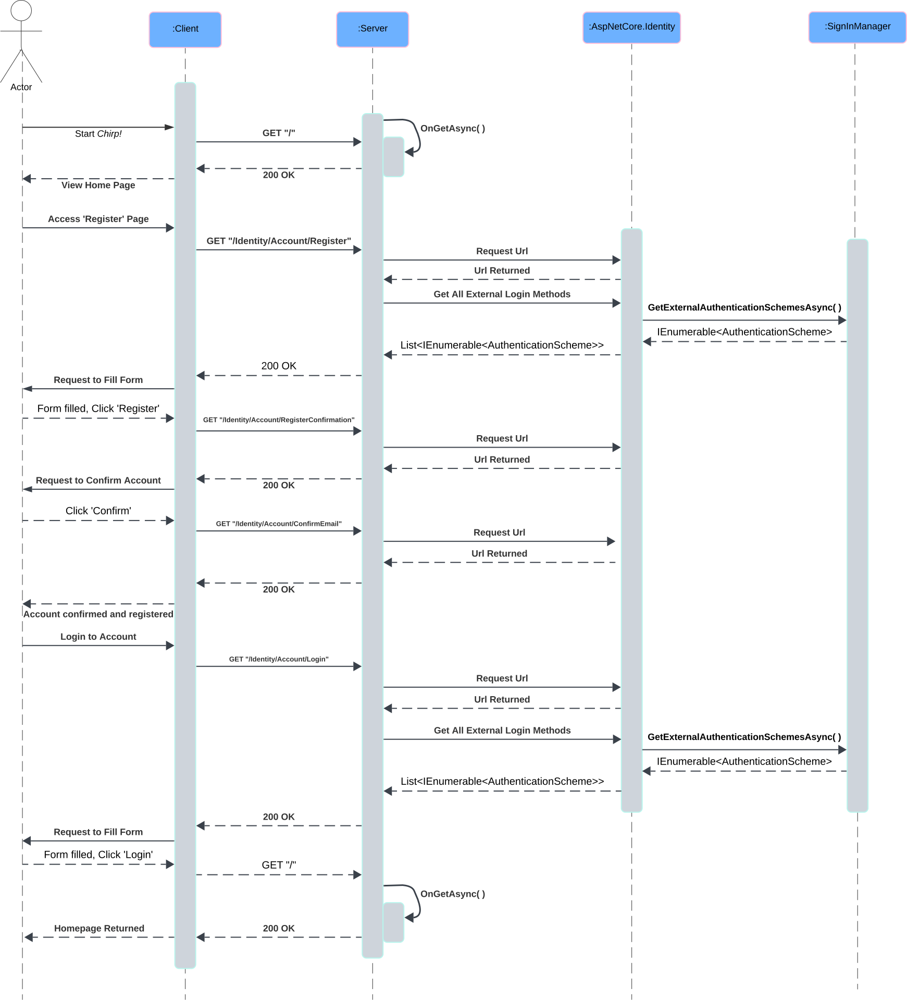
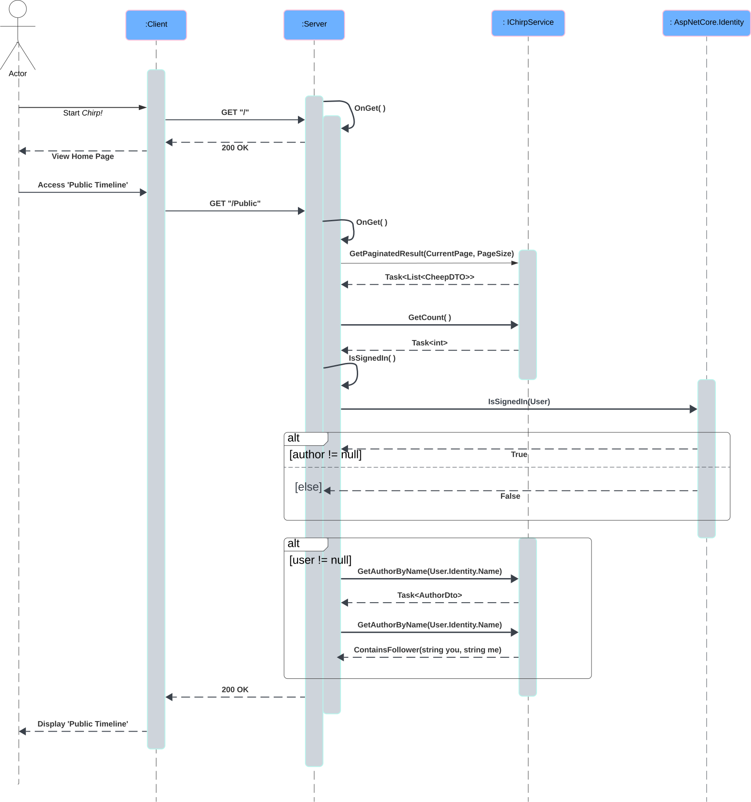
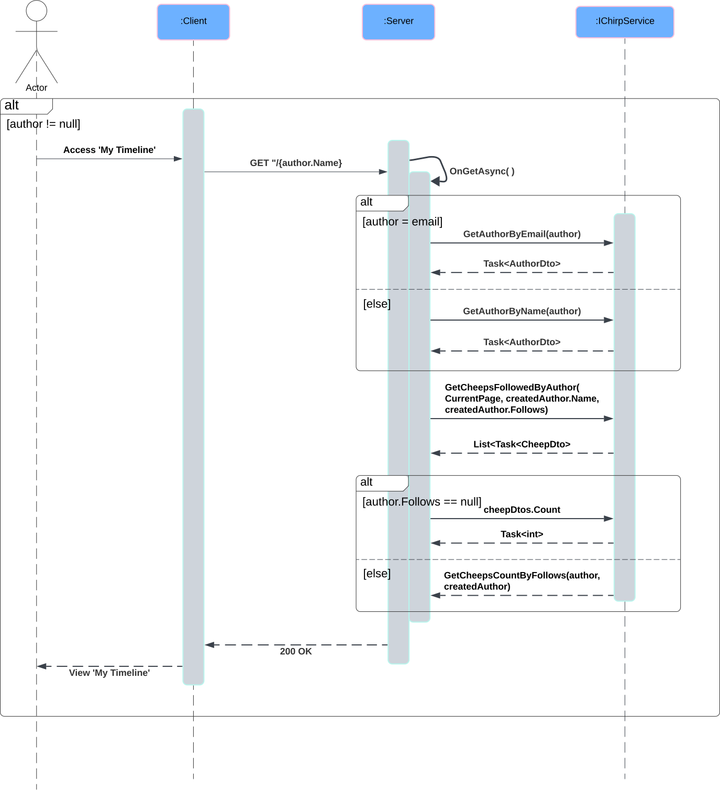
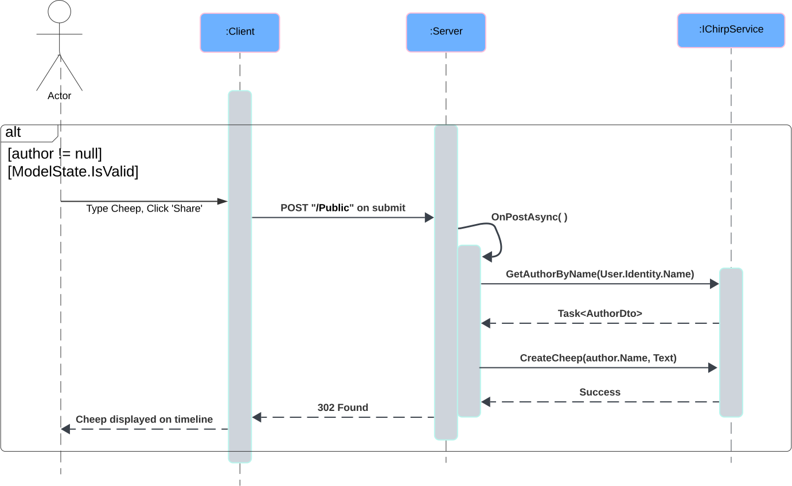
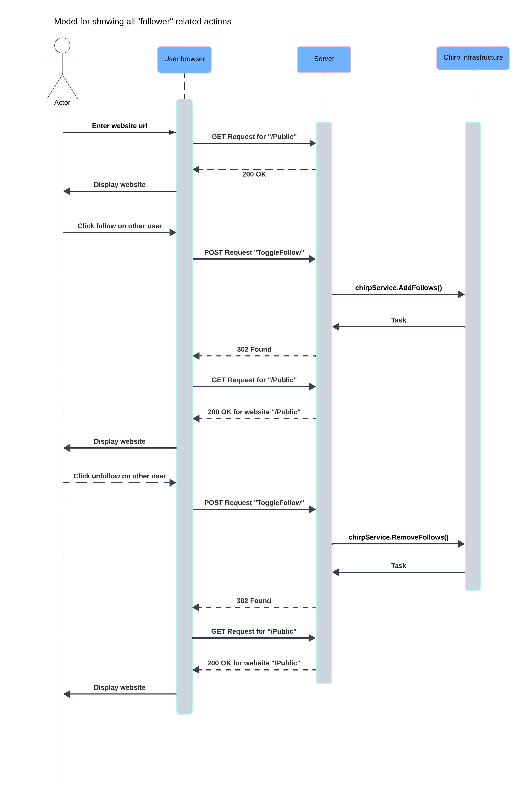
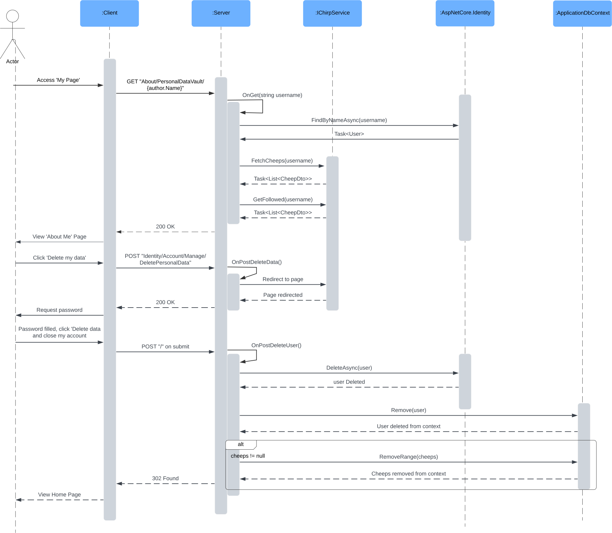
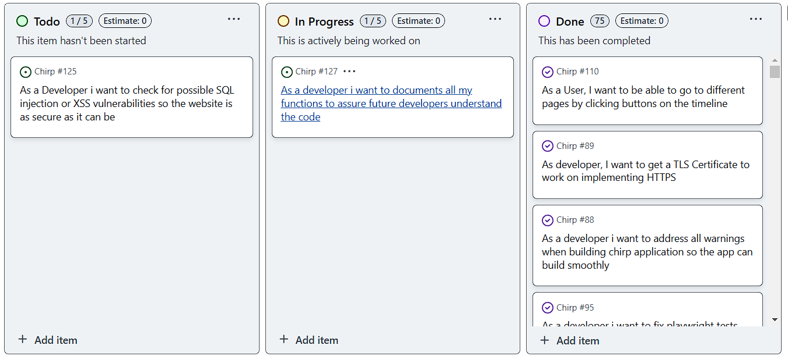
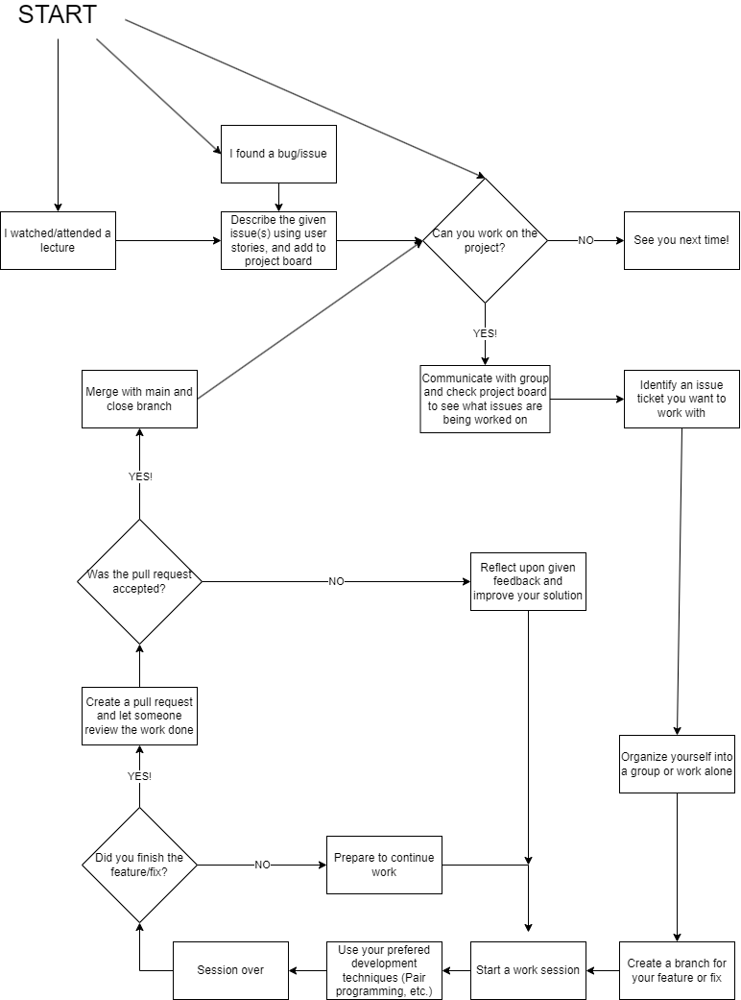

---
title: _Chirp!_ Project Report
subtitle: ITU BDSA 2024 Group `5`
author:

- Markus Sværke Staael <msvs@itu.dk>
- Patrick Shen <pash@itu.dk>
- Frederik Terp <fter@itu.dk>
- Nicky Chengde Ye <niye@itu.dk>
- Marius Cornelius Wisniewski Larsen <coml@itu.dk>
- Sara Ziad Al-Janabi <salj@itu.dk>

numbersections: true
toc: true
toc-depth: 4
include-before:
- '`\newpage{}`{=latex}'

---

\newpage

# Design and Architecture of _Chirp!_ <a name="design"></a>

## Domain model <a name="domain"></a>


The Chirp application purposely utilizes an onion architecture to promote a clear separation of concern.
The "onion" consists of multiple layers with the core being Chirp.Core, where the domain model resides. 
The domain model is relatively simple and represents 'Authors' and 'Cheeps'.
The author model extends an IdentityUser from ASP.NET Core Identity to make it work seamlessly 
with the rest of the ASP.NET Core ecosystem. 

\newpage
## Architecture — In the small <a name="architecture-in-the-small"></a>


The rest of the layers are categorized as Chirp.Infrastructure and Chirp.Web with the thickest layer being the infrastructure. 

### Infrastructure Layer
The infrastructure layer can be further broken down in three sub-layers. Starting from the core and moving out one layer,
there is an **ApplicationDbContext** that extends an **IdentityDbContext**. This is to provide a way for the application to interact and manipulate the entities in the database.

The next layer is the repository layer that interacts with the **ApplicationDbContext** by implementing methods to extract specific data from the database. 
To comply with the "Repository Design Pattern", two repositories are implemented; the **AuthorRepository** and the **CheepRepository** that both
interact with their respective entities in the database.

To interact with both **Author** and **Cheep** entities in a simple manner, a service called **ChirpService** is implemented.
The service combines the two repositories by implementing identical methods that call the respective repository methods.
Another purpose of the service is to make development easier by providing only a single point of access to the database for injection.

Both repositories and the service implement respective interfaces to enable dependency injection, which makes it easier to test for functionality and coverage. 

The last layer of the infrastructure layer is the 'Data Transfer Object' layer. The DTOs serve the purpose of only
providing the necessary data in order to not expose the entire domain model to the user, as there can be sensitive or unnecessary data.

### Web Layer
The 'Web' layer is the outermost layer and is responsible for handling the front-end portion of the *Chirp!* application i.e. the user interface of the website.


## Architecture of deployed application <a name="deployed"></a>

\newline
As illustrated above, the user sends requests to the Azure server and receives responses from it through the HTTP-protocol. Multiple clients can connect to the Azure server simultaneously. The Azure server sends an HTTP-request to the *Chirp!* application with a required cookie for the user session. The *Chirp!* web-application communicates with the database itself with SQLite3.
The production deployment uses the HTTPS-protocol, which ensures vulnerable user data in the responses are encrypted with a TLS-certificate.
&nbsp;

## User activities <a name="useractivities"></a>
This section illustrates typical scenarios that the user may go through when using our *Chirp!* application.
This includes cases for both unauthorised and authorised users.
The illustrations are shown as sequences of activities in the format of UML Activity Diagrams.
&nbsp;

### Register Account
{width=auto; height=60%}
\newline
This diagram illustrates the registration of a user.
When a user registers, if all criteria are fulfilled, they will be led to the e-mail confirmation page. 
In the case of a missing criteria, e.g. the user has typed an invalid e-mail address, a warning will be displayed
informing the user about the missing criteria.
&nbsp;

### Submit cheep
{width=auto; height=60%}
\newline
This diagram displays the sequence of a user
typing a cheep.
If the message box is empty, a warning will be displayed.
&nbsp;

### Follow User
{width=auto; height=60%}
\newline
This diagram shows what occurs once a user tries to follow another user.
If user isn't logged in, they will be redirected to the login page. Otherwise,
depending on whether the user already follows someone else or not, either 'Follow' or 'Unfollow'
will be displayed.
&nbsp;

### Private Timeline
{width=auto; height=60%}
\newline
This diagram shows the sequence of a user visiting their own page.
&nbsp;

### Delete account
{width=auto; height=60%}
\newline
If a user wishes to delete their data, this user activity sequence would be a typical scenario.
&nbsp;

\newpage

## Sequence of functionality/calls through _Chirp!_ <a name="sequence"></a>
When running the application, messages and data are sent back and forth from
the requests from the user to the server and ASP.NET Core. This is illustrated by the UML Sequence Diagrams,
that show how the system works, and how the entities interact with each other. The intention of the diagrams is to
visualise the process from when a user-request is sent, to the final rendered webpage shown to the user.

The diagrams illustrate the following sequences:

1. when a user registers a new account, and login
2. when a user accesses the Public Page
3. when a user accesses their own private timeline
4. when a user types a cheep 
5. when a user follows someone else
6. when a user deletes their account

The diagrams are shown below:

### Register and Login

This diagram shows the flow of when a user starts the application and wants to register a new account. After registering,
the user logs in to their newly registered account.
&nbsp;

### Public Page
{width=auto; height=60%} 
\newline
This diagram shows the flow of when a user starts the application, and then tries to access the Public Timeline-site.
&nbsp;

### Private Timeline
{width=auto; height=60%}
\newline
This diagram shows the flow of a user accessing their own timeline, 'My Timeline'. This sequence is only available when
a user is logged in.
&nbsp;

### Type Cheep
{width=auto; height=60%}
\newline
This diagram shows the interaction between the entities when the user wants to type a cheep in the application. This function is only
available when a user is logged in.
&nbsp;

### Follow User
{width=auto; height=60%}
\newline
This diagram illustrates how the user accesses the public page, and wants to follow or unfollow
another user from said page.
&nbsp;

### Delete Account
{width=auto; height=60%}
\newline
This diagram shows the interaction between the entities, when a user decides to delete their account.
&nbsp;

\newpage

# Process <a name="process"></a>

## Build, test, release, and deployment <a name="buildtest"></a>

### build_and_test.yml

\newline
This workflow builds and tests the code on push- and pull-requests on the master branch. When this condition is achieved, it restores dependencies, builds with no restore because of the last step, and attempts to run it locally. 
Before running the tests, it installs the test-framework 'PlayWright' in order to run the tests found in PlaywrightTests directory. The ones found in test/Chirp.Razor.Test are run by xUnit.  
If any of these steps fail, the workflow fails and the push or pull-request on the master branch is cancelled. If not, it proceeds with the action.
&nbsp;

### master_bdsagroup5chirprazor2024.yml

\newline
This workflow is triggered by a push on the master branch and is responsible for deploying the code/build to Azure. When triggered, it creates a build with the release configuration.
Next, it publishes the project  to the output folder defined after -o and uploads the published folder as an artifact for the Azure web application to deploy.
The 'Deploy to Azure'-step deploys the application to the Production environment with the webapp URL.
&nbsp;


### release.yml

\newline
This workflow is triggered when adding the following tag on push:
```- v*.*.* ```

 The steps *restore*, *build* and *tests* are the same as the previously mentioned *build_and_test* workflow. 
 If it succeeds, it proceeds with the workflow by publishing the following project files:
 
    1. src/Chirp.Core/Chirp.Core.csproj
    2. src/Chirp.Infrastructure/Chirp.Infrastructure.csproj
    3. src/Chirp.Web/Chirp.Web.csproj

with the following release configurations: linux-x64, win-x64, osx-x64 and osx-arm64 with corresponding output folders and compresses them into zip-files.
The release then include the zip-files and the source code
&nbsp;

## Team work <a name="teamwork"></a>
Below is the project board for Group 5.
The uncompleted tasks are:

    1. As a Developer i want to check for possible SQL injection or XSS
        vulnerabilities so the website is as secure as it can be
    2. As a developer i want to documents all my functions to assure
        future developers understand the code

All other features have been completed, this solution for *Chirp!* should not be missing any features or functionality.
\newline

&nbsp;
Below is a flowchart modeling of how teamwork has been conducted in Group 5.
\newline
{width=auto; height=60%}
&nbsp;

The process "From issue to solution" starts after all members having attended the given week's lecture. Shortly after that lecture, the group will find a room to sit and organize themselves. Here, a few group members start identifying and then quantifying that week's problems by creating issue tickets. 
When all problems have their respective issue tickets, the group will subdivide itself into smaller groups where individuals work together or independently to solve the specific issue(s). A new branch will be created where all work for the feature/fix will be deposited. 
Whenever a specific issue is solved, its respective branch may be merged into main and the issue will be closed. If an issue is not solved by the end of the day, individuals will work from home to solve/close the issue, or if necessary, the group will meet again before the next week's lecture (when new issues will be added).


## How to make _Chirp!_ work locally <a name="localchirp"></a>

### Running from Compiled

1. Access [our release page](https://github.com/ITU-BDSA2024-GROUP5/Chirp/releases "Title"). 

2. Download the zip containing the compiled version of the program corresponding to the system you want it to run on. 

3. Unzip the zip file into a given directory / %unzippedcontentdir% and run

    <b>UNIX-based systems</b>

    3.1. Open up a terminal and run the following
    
        cd %unzippedcontentdir%/publish/%systemarchitecture%
        ./Chirp.Web

    <b> Windows</b>
    
    3.1. Open up CMD and run the following
            
        cd %unzippedcontentdir%/publish/win-x64
        Chirp.Web.exe
        

4. The terminal/cmd should now show the following: Now listening on: http://localhost:5000

5. Accessing your localhost on the given port should now give you access to the local running instance of the web-app

### Running from Source code
1. Pull the source code from GitHub. This can be done by opening terminal/cmd and typing the following
```
    git pull https://github.com/ITU-BDSA2024-GROUP5/Chirp.git
```
2. Navigate to the project directory and run
```
    cd Chirp/src/Chirp.Web
    dotnet run
```
3. By default, the terminal should now show - Now listening on: http://localhost:5177

If not, follow the following steps.
1. Run ```dotnet dev-certs https --trust```

2. Set user secrets by
```
dotnet user-secrets init
dotnet user-secrets set "authentication:github:clientId" "YOURCLIENTID"
dotnet user-secrets set "authentication:github:clientSecret" "YOURCLIENTSECRET"
```


## How to run test suite locally <a name="localtest"></a>
The test suite is seperated into two folders: Chirp.Razor.Test contains unit and integration tests, and PlayWrightTests contains end-to-end tests.
Unit tests are made for all the methods in AuthorRepository and CheepRepository. A couple of integration tests are created in the Razor Page framework.
The end-to-end tests are run with PlayWright and tests the UI elements Chirp by simulating user input.

### Prerequisites
Playwright needs powershell to be installed locally

**Guide to download for linux**: https://learn.microsoft.com/en-us/powershell/scripting/install/installing-powershell-on-linux?view=powershell-7.4

**Guide to download for MacOS**: https://learn.microsoft.com/en-us/powershell/scripting/install/installing-powershell-on-macos?view=powershell-7.4

### Windows
There is 2 ways to run the test suite

The provided script

  1. Run ``` cd test; ./CompileAndRunTests.bat```

Manually running the commands

  1. Run ``` dotnet run --project src/Chirp.Web ```
  2. Open powershell and run ``` .\Test\PlaywrightTests\Bin\Debug\net8.0\playwright.ps1 install```
  3. Open a new command prompt
  4. Run ``` dotnet test ```

### Linux 
There is 2 ways to run the test suite

The provided script

  1. Run ``` cd test; ./CompileAndRunTests.sh```

Manually running the commands

  1. Run ``` dotnet run --project src/Chirp.Web & ``` to start it as a background process so it doesn't block the command prompt
  2. Run
     pwsh -ExecutionPolicy Bypass
    -File "./test/PlaywrightTests/Bin/Debug/net8.0/playwright.ps1" install-deps
  3. Run
     pwsh -ExecutionPolicy Bypass -File
     "./test/PlaywrightTests/Bin/Debug/net8.0/playwright.ps1" install
  4. Run ``` dotnet test ```
  5. Run ``` kill -9 $(lsof -t -i tcp:5177) ``` to kill the background process running the website

### Mac
There is 2 ways to run the test suite

The provided script

  1. Run ``` cd test; ./CompileAndRunTests.sh```

Manually running the commands

  1. Run ``` dotnet run --project src/Chirp.Web & ``` to start it as a background process so it doesn't block the command prompt
  2. Run
     pwsh -ExecutionPolicy Bypass -File
     "./test/PlaywrightTests/Bin/Debug/net8.0/playwright.ps1" install-deps
  3. Run
     pwsh -ExecutionPolicy Bypass -File
     "./test/PlaywrightTests/Bin/Debug/net8.0/playwright.ps1" install
  4. Run ``` dotnet test ```
  5. Run ``` kill -9 $(lsof -t -i tcp:5177) ``` to kill the background process running the website

# Ethics <a name="ethics"></a>
## License <a name="license"></a>

The license chosen for the program is the MIT license due to its simplicity and flexibility. The license is short and transparent, making it easy to understand. It has minimal restrictions and allows for both commercial and non-commercial use. Anyone wanting to use the source code are allowed to use it for their purposes but as it is, meaning that the source code is delivered as is without any warranty and that we the developers do not hold any liability .

## LLMs, ChatGPT, CoPilot, and others <a name="chatgpt"></a>
<p>
LLMs have been used in a limited capacity in the development of Chirp.
CoPilot, as an integrated feature in Rider and GitHub, have mainly been used in code generation/assistance and has cut down the time spent on writing generic code. 
Occasionally, LLMs has been used for bug fixes. This is usually done by giving ChatGPT a block of code along with the prompt "Please fix" to identify simple syntax errors, 
which have been hard to spot. Aside from directly in-code, LLM has been used in research as a substitute for search engines and documentation. 
An example from development would be using ChatGPT to research how to implement "Identity Core".

In terms of helpfulness, LLMs have been used in cases where advice and guidance was needed and not when looking for a direct solution.
The benefits of using LLMs are similar to asking a TA for help in understanding a certain topic or troubleshooting, but more accessible and time-efficient. 
When presented with an incorrect or false response, it is simply dismissed and heeded as bad advice.

Generally, the use of LLMs have sped up the development by enabling individual work by giving benefits similar to peer-programming. 
</p>

