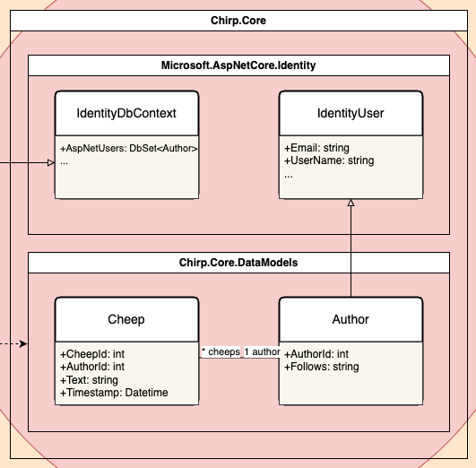

---
title: _Chirp!_ Project Report
subtitle: ITU BDSA 2024 Group `<no>`
author:
- "Helge Pfeiffer <ropf@itu.dk>"
- "Adrian Hoff <adho@itu.dk>"
numbersections: true
---
_Chirp!_ Project Report
==============
***ITU BDSA 2024 Group 5***
- Markus Sværke Staael <msvs@itu.dk>
- Patrick Shen <pash@itu.dk>
- Frederik Terp <fter@itu.dk>
- Nicky Ye <niye@itu.dk>
- mariuslarsen <coml@itu.dk>
- salj <salj@itu.dk>

# Table of Contents
1. [Design and Architecture of _Chirp!_](#design)
2. [Domain Model](#domain)
3. [Architecture - In the small](#architecture)
4. [Architecture of deployed application](#deployed)
5. [User activities](#useractivities)
6. [Sequence of functionality/calls through _Chirp!_](#sequence)
7. [Process](#process)
8. [Build, test, release and deployment](#buildtest)
9. [Team work](#teamwork)
10. [How to make _Chirp!_ work locally](#localchirp)
11. [How to run test suite locally](#localtest)
12. [Ethics](#ethics)
13. [License](#license)
14. [LLMs, ChatGPT, CoPilot, and others](#chatgpt)

# Design and Architecture of _Chirp!_ 

## Domain model 

 
The Chirp application actively utilizes an onion architecture to promote a clear separation of concern.
The onion has many layers but the core of it is Chirp.Core, where the domain model resides. 
The domain model is relatively simple and represents authors and cheeps.
The author model extends an IdentityUser from Asp.Net Core Identity to make it work seamlessly 
with the rest of the Asp.Net Core ecosystem. 

## Architecture — In the small 

 
As previously mentioned the onion architecture has many layers, but so far we have only covered the core. The rest of the layers are categorized as
Chirp.Infrastructure and Chirp.Web with the thickest layer being the infrastructure layer. 

The infrastructure layer can be further broken down in three sublayers. Starting from the inside and moving out
there is a ApplicationDbContext that extends an IdentityDbContext to make it work seamlessly with the rest of the Asp.Net Core ecosystem.
The purpose of the ApplicationDbContext is to provide a way to interact with the entities in the database.

The next layer is the repository layer that interacts with the ApplicationDbContext by implementing methods to extract specific data from the database. 
To comply with the repository pattern there are two repositories, the author repository and the cheep repository that both
interact with their respective entities in the database.

To interact with both author and cheep entities in a simple manner, a chirp service is implemented that uses the two repositories.
The service combines the two repositories by implementing identical methods that call the repository methods.
Another purpose of the service is also make development easier by providing only a single point of access to the database, to be injected.

Both repositories and the service implement respective interfaces to enable dependency injection and make the code more testable.

The last layer of the infrastructure layer is the data transfer object layer. The data transfer objects serve the purpose of only
providing the necessary data to not expose the entire domain model to the user as there can be sensitive or unnecessary data.

The web layer is the outermost layer and is responsible for handling the frontend portion of the chirp application 
by providing a user interface.

## Architecture of deployed application 

## User activities 
This section illustrates typical scenarios that the user may go through when using our *Chirp!* application.
This goes for both unauthorised and authorised users, in which both cases have been included.
The illustrations are shown as sequence of activities in the format of UML Activity Diagrams.

This diagram illustrates the registration of a user.
When a user registers, if all criteria fulfilled, they will be led to the email confirmation page. 
In the case of a missing criteria, e.g. the user has typed an invalid e-mail address, the warning displayed
will inform the user about said missing criteria.

This diagram displays the sequence of user activity, if the user
wishes to type a cheep.
If the message box is empty, a warning will be displayed.

This diagram shows what occurs once a user tries to follow another user.
If user isn't logged in, they will be redirected to the login page. Otherwise,
whether the user already follows someone else or not, either 'Follow' or 'Unfollow'
will be displayed.

This diagram simply views the sequence if a user wishes to view their own page. User
must be logged in before being able to do so.

If a user wishes to delete their data, this user activity sequence would be a typical
scenario.

## Sequence of functionality/calls through _Chirp!_ 

# Process 

## Build, test, release, and deployment 

## Team work 

## How to make _Chirp!_ work locally 

## How to run test suite locally 

# Ethics 

## License 

## LLMs, ChatGPT, CoPilot, and others 
